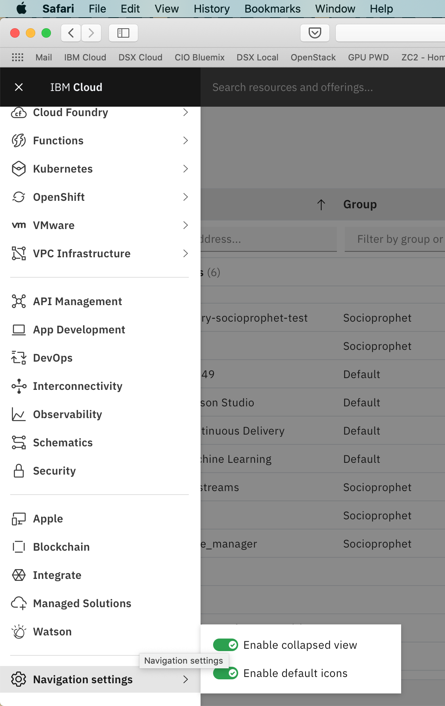
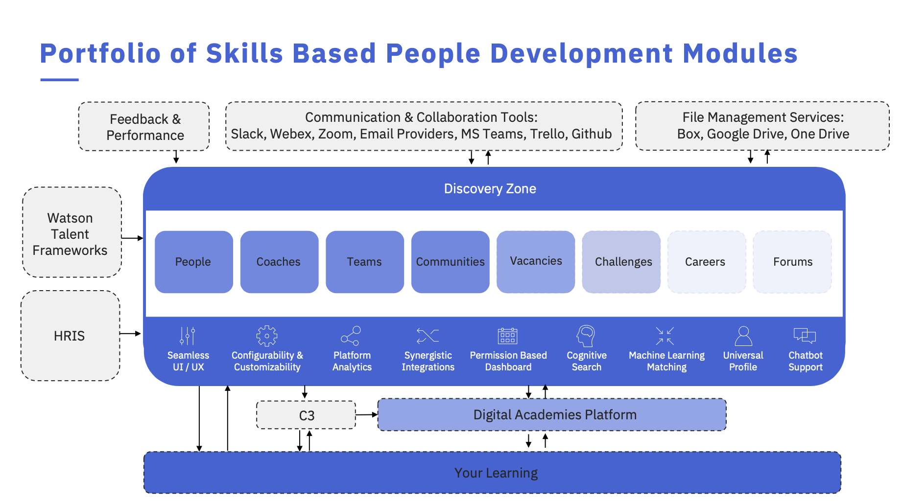

# Ontogenesis — MIT-Licensed Ontology Genesis, Linking, and Alignment Framework

Base IRI: `https://socioprophet.dev/ont/ontogenesis#`  
Current Version IRI: `https://socioprophet.dev/ont/ontogenesis#v0.3.0`

Ontogenesis is a reusable framework for constructing, linking, validating, and evolving bespoke ontological graphs under uncertainty.

This repository currently includes Human Digital Twin-oriented core terms and examples, but its purpose is broader than any single application. Ontogenesis provides the scaffolding for ontology creation, ontology-to-language and language-to-ontology interfaces, graph binding, provenance capture, policy-aware validation, and iterative refinement through annealing loops.

## What Ontogenesis is for

Ontogenesis supports:

- seed ontology creation from observation, claims, measurements, and partial structure
- ontology linking across local, domain, and world models
- mapping and binding layers between heterogeneous schemas and vocabularies
- provenance, policy, and validation over evolving graph artifacts
- iterative ontology refinement under uncertainty
- ontology alignment in the wild, including noisy or partially compatible external vocabularies

## Layered Mapping and Binding Use Cases

### Lower ontology bindings

Lower-layer bindings connect close-to-source semantics into a usable graph. These may include:

- sensor and wearable observations
- human-facing measurements
- device telemetry
- local embodiment and state representations
- consent, provenance, and evidence attached to raw or derived observations

This layer is where local data first becomes semantically structured.

### Middle ontology bindings

Middle-layer bindings connect operational and relational structure between local observations and broader world models. These may include:

- claims, annotations, and knowledge artifacts
- cases, tasks, workflows, and interventions
- policy decisions and evaluation events
- interaction models between agents, systems, and environments

This layer is where local structure becomes actionable and relational.

### Upper ontology bindings

Upper-layer bindings connect local and middle-layer structures to broader environmental, conceptual, or world-model semantics. These may include:

- world and environment models
- domain reference ontologies
- temporal, spatial, organizational, or systemic frames
- higher-order constraints and shared semantic anchors

This layer is where bespoke graphs become interoperable with broader semantic systems.

### Ontology alignment in the wild

Ontogenesis is also intended for messy real-world alignment work, including:

- reconciling competing vocabularies
- attaching SKOS concepts to formal classes
- mapping external schemas into local graph structures
- using JSON-LD contexts as boundary surfaces
- preserving provenance while progressively normalizing and linking terms
- supporting partial, provisional, or evolving alignments instead of pretending the world is tidy

## Annealing and Lifecycle

Ontogenesis assumes that ontology work begins with incomplete knowledge.

A graph may begin as a seed formed from weak observations, provisional labels, noisy measurements, or incomplete claims. Through repeated refinement, that graph can be:

- seeded
- normalized
- linked
- trusted
- made actionable
- delivered

This repository uses validation and lifecycle gates so graph artifacts can become more grounded over time rather than being treated as perfectly known from the start.

## Current Framework Surfaces

The repository includes:

- `ontogenesis.ttl` — core ontology (Turtle)
- `skos/*.ttl` — SKOS vocabularies and concept schemes
- `shapes/*.ttl` — SHACL constraints
- `mappings/*.ttl` — interoperability mappings such as PROV, FHIR, and IEML
- `context.jsonld` — JSON-LD boundary/context surface
- `examples/*.ttl` — example datasets
- `tests/*.rq` — SPARQL invariant tests
- `capd/*.json` — capability packaging metadata
- `tools/validate.py` — local validation entrypoint

## Relationship to Applications

Ontogenesis is a framework, not a single domain application.

Applications such as Human Digital Twin may use Ontogenesis as an ontology and interface substrate, but the framework is intentionally broader: it exists to support the creation and evolution of bespoke ontological graphs for humans, digital agents, hybrid systems, and their environments.

## Diagrams





## Quickstart

Install validation dependencies:

```bash
python3 -m venv .venv && . .venv/bin/activate && pip install -r requirements.txt
```

Validate ontology + examples:

```bash
make validate
```

## License

This repository is licensed under the MIT License. See `LICENSE`.
